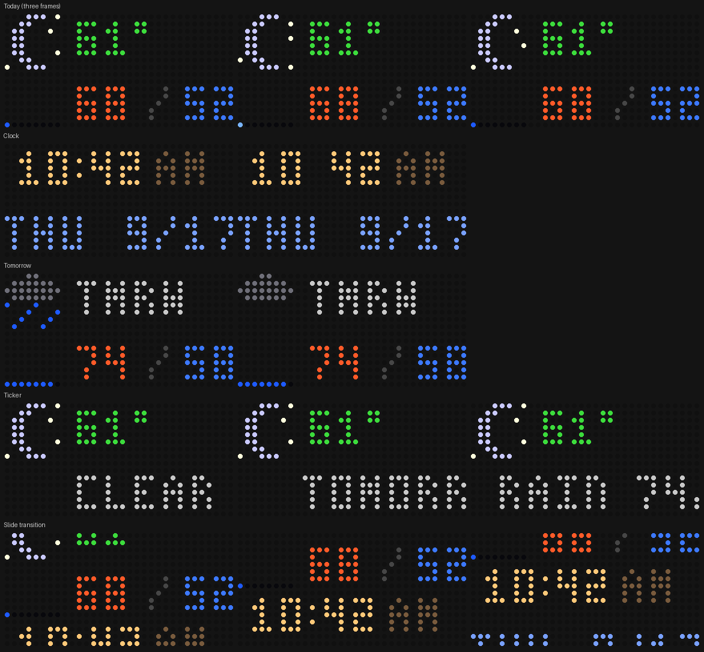

# NeoPixel Weather Display (ESP32-S3, CircuitPython)

A 32×16 weather station built from two 32×8 flexible NeoPixel panels and an ESP32-S3. It pulls the forecast from Open-Meteo (free, no API key), sets its clock from the internet, and cycles through four pages with a slide transition between them. The icons animate — the sun's rays pulse, stars twinkle around the moon, rain and snow fall, lightning flashes, fog drifts — and the panel dims itself at night.

All the drawing lives in `weather_gfx.py`, which is plain Python with no board dependencies, so any screen can be rendered to a PNG on your computer to check the look before it goes on the hardware.

## Demo video

[](https://youtu.be/ubvbZc6w2Hk)

*Click the image to watch on YouTube.*

## What the display shows



**Today** – The 8×8 icon at top-left is the current sky. To its right, the current temperature, colored by how it feels: blue-white below 40°, blue in the 40s, green 55–69, orange 70–84, red 85 and up. On the lower panel, today's high (orange, left) and low (blue, right). The row of dots under the icon is today's chance of precipitation: eight slots, each lit dot ≈ 12.5%, blue for rain and white for snow, with the last dot twinkling when any are lit.

**Clock** – 12-hour time with a blinking colon and AM/PM, then the weekday and month/day.

**Tomorrow** – Tomorrow's icon, "TMRW", tomorrow's high/low, and tomorrow's precipitation dots.

**Ticker** – Today's icon and temperature stay on top while a one-line summary scrolls across the bottom: the current condition, a rain/snow percentage if it's 30% or higher, and tomorrow's condition and high/low.

Icons: sun, moon with stars, sun or moon behind a cloud, cloud, rain, snow, thunderstorm (lightning alternating with rain), fog.

## Parts List

| Part | Notes | Where |
|---|---|---|
| ESP32-S3 DevKitC-1 N16R8 (YD-ESP32-S3 compatible), headers pre-soldered, with screw-terminal expansion board | Flash the "YD-ESP32-S3 N16R8" CircuitPython build | [Amazon (QIQIAZI 2-pack)](https://a.co/d/02ooVs7D) |
| 2 × WS2812B 32×8 flexible NeoPixel panels | Chained DOUT → DIN | [AliExpress](https://www.aliexpress.us/item/3256805075934735.html) |
| 5 V 4 A switching power supply, 2.1 mm barrel plug | Powers the panels. 512 pixels cannot run from USB. | [Adafruit 1466](https://www.adafruit.com/product/1466) |
| Female 5.5 × 2.1 mm DC barrel jack to screw-terminal adapter | Brick → panel power leads | [Amazon (CHANZON 10-pack)](https://www.amazon.com/s?k=2.1mm+female+DC+barrel+jack+to+screw+terminal+adapter) |
| 22 AWG hookup wire | Power leads to the barrel adapter | |
| A few M-M jumper wires | Data and ground to the ESP32 | [Amazon (Aypzuke 240-pc kit)](https://a.co/d/0h3WT8NL) |
| USB-A to USB-C **data** cable | Into the port labeled **USB** (native port), not COM | |

## Wiring

| From | To |
|---|---|
| Brick + / − (barrel adapter screw terminals) | Panel 1's red / black **power injection leads** — the thick separate pair, not the JST. If panel 2 has its own pair, run it to the same screws so each panel gets power directly. |
| Panel 1 JST **green** (DIN) | ESP32-S3 **GPIO15** |
| Panel 1 JST **white** (GND) | ESP32-S3 **GND** — the shared ground is required |
| Panel 1 JST **red** | Nothing — tape it off; it's live 5 V |
| Panel 1 DOUT connector | Panel 2 DIN connector |
| ESP32-S3 | USB, for power and the serial console |

Data goes into the panel's **DIN** end (look for the arrow, or "DI" near the corner pixel). The other end is DOUT and shows nothing if you feed it.

Keep the brick's 5 V off the ESP32's 5V terminal while USB is connected. On a stock YD-ESP32-S3 the 5V pin is input-only anyway (the IN-OUT solder jumper ships open), which is also why nothing plugged into that pin gets power from USB.

Brightness matters: at `brightness=0.12` the full 512-pixel display stays inside the 4 A supply in any color. If the board reports "Power dipped" and drops into safe mode, the panels pulled the supply down — lower the brightness and press RST (Ctrl-D does not clear safe mode).

### Panel layout and mapping

Each panel is a vertical serpentine: pixel 0 at top-left, snaking down column 0, up column 1, and so on. Panel 1's DOUT is at its right edge, so panel 2 hangs below it **rotated 180°**, with its first pixel at bottom-right. `weather_gfx.xy(x, y)` converts a physical coordinate (x 0–31 left to right, y 0–15 top to bottom) to the pixel index for this arrangement:

```python
def xy(x, y):
    if y < 8:                                  # top panel
        col, row = x, y
        return col * 8 + (row if col % 2 == 0 else 7 - row)
    col, row = 31 - x, 15 - y                  # bottom panel, rotated 180
    return 256 + col * 8 + (row if col % 2 == 0 else 7 - row)
```

If your panels are mounted differently, that one function is all you change. `corner_test.py` lights the four corners in different colors, marks the seam, then draws a border, so you can confirm the mapping before running the weather code.

## Setup

1. Install CircuitPython 10.x on the board with the [circuitpython.org web installer](https://circuitpython.org/board/yd_esp32_s3_n16r8/): hold BOOT, tap RST, release BOOT, then follow the installer. When it asks you to select the YDESP32S3 drive, press RST once and pick that drive.
2. From the [CircuitPython library bundle](https://circuitpython.org/libraries), copy these folders into `CIRCUITPY/lib/`: `adafruit_requests`, `adafruit_connection_manager`, `adafruit_ntp`. (`neopixel` is built into this board's firmware.)
3. Copy `code.py` and `weather_gfx.py` to `CIRCUITPY/`.
4. Copy `settings.toml.example` to `CIRCUITPY/settings.toml` and enter your Wi-Fi name and password. For an open network leave the password as `""`. CircuitPython supports WPA2-Personal only — not enterprise (eduroam-style) or captive-portal networks. On a MAC-registered campus network, the board's MAC address is in `boot_out.txt` on the CIRCUITPY drive.
5. Set your location at the top of `code.py` (`LAT`, `LON`). Time zone and daylight saving come from the weather API automatically.

Press RST. The panel shows **WIFI** in blue while it connects (red while retrying), then the weather. The serial console prints the raw forecast JSON on the first fetch, one summary line per refresh, and the time whenever the clock resyncs.

## How the code works

`code.py` connects to Wi-Fi, then loops: every ten minutes it fetches the forecast (current temperature and weather code, day/night flag, and two days of highs, lows, precipitation probability and weather codes) and every hour it sets the real-time clock from NTP using the UTC offset the weather API returned. The rest of the loop is a page scheduler: each page has a dwell time (the ticker runs until its message finishes), and when it's time to change, the old and new screens are rendered and a 16-step slide plays between them.

`weather_gfx.py` has the panel mapping, a 3×5 pixel font (digits, A–Z, and a few symbols), the 8×8 icons as small text pictures with one letter per color, and one render function per page. Each render function returns a dictionary of `(x, y) -> (r, g, b)`; `show()` in `code.py` pushes that through `xy()` to the strip. Because there's no hardware in `weather_gfx.py`, `preview.py` can call the same functions on a laptop and draw the result with Pillow.

## Tuning (top of `code.py`)

| Setting | Default | What it does |
|---|---|---|
| `LAT`, `LON` | Boston College | Forecast location |
| `BRIGHT_DAY` / `BRIGHT_NIGHT` | 0.12 / 0.05 | Brightness; keep daytime ≤ 0.12 for 512 pixels on a 4 A supply |
| `PAGE_SEC` | 10 / 6 / 6 | Seconds for the today, clock and tomorrow pages |
| `ICON_FRAME` | 0.4 | Icon animation speed (seconds per frame) |
| `SCROLL_STEP` | 0.06 | Ticker speed (seconds per pixel) |
| `REFRESH_SEC` | 600 | Forecast refresh interval |
| `PAGES` | all four | Remove pages you don't want, e.g. `["weather", "clock"]` |

## Files

- `code.py` – Wi-Fi, forecast fetch, NTP clock, page cycling and animation
- `weather_gfx.py` – panel mapping, font, icons, page renderers (pure Python)
- `settings.toml.example` – Wi-Fi credentials template; copy to `settings.toml` on the board (`settings.toml` is git-ignored)
- `corner_test.py` – verifies the panel mapping
- `preview.py` – renders the pages to `preview.png` on a computer (`pip install pillow`)
- `preview.png` – the rendered pages

## Ideas

- Color the ticker text by condition (blue for rain, white for snow).
- Show sunrise and sunset (add `sunrise,sunset` to the `daily` parameters in the URL).
- Replace the tomorrow page with a three-day strip: three small icons with highs underneath.
- Reuse `weather_gfx` for something else: a scrolling message board, a class countdown timer, a scrolling EKG trace from the pulse-sensor project.
